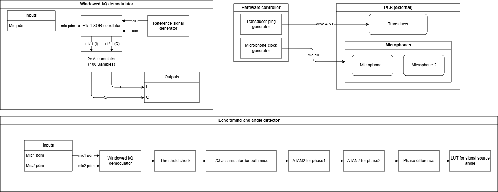

<!---

This file is used to generate your project datasheet. Please fill in the information below and delete any unused
sections.

You can also include images in this folder and reference them in the markdown. Each image must be less than
512 kb in size, and the combined size of all images must be less than 1 MB.
-->

## How it works

The chip drives a 40kHz ultrasonic transducer (drive_a/drive_b) for a short burst, then listens on two PDM microphones. Each mic's PDM stream is correlated against 40kHz sine/cosine reference signals (ref_sig) in 100-sample (25microseconds) windows to produce I/Q values (windowed_iq_demodulator + correlator). When the combined I/Q magnitude on both mics crosses a threshold for at least 5 consecutive windows, the chip accumulates I/Q over that echo window, runs a CORDIC atan2 on each mic's accumulated I/Q to get its phase, and takes the phase difference between the two mics. A lookup table (phase_difference_to_angle) maps that phase difference to a 6-bit angle (some phase-difference ranges are geometrically invalid for a 2-mic array and are flagged as invalid). The window index at which the echo started is reported as echo_window_index, from which target distance can be computed. Every echo found during one measurement is reported; the pins always show the most recent one, the UART sends one line per echo.

## How to test

1. Connect the PCB, hold `rst_n` low for at least one clock, then release it. Set `single_mic` high if only mic1 is fitted. The chip refuses to ping until the mic power-up sequence has finished (~110 ms).
2. Start a measurement (choose one)
    - Single Ping: Pulse the `start_measurement` pin to start a measurement or send the UART command `P`
    - Auto measurement: set `auto_enable` pin HI or send the UART command `A`
3. Read the results:
    - From the GPIO pins
    - Through UART

## Reading the output

### GPIO
- `mux_sel = 0`: `data_out[11:0]` = `echo_window_index`
- `mux_sel = 1`: `data_out[11:0]` contains:
    - `[5:0]` - horizontal angle (6‑bit, wrapped signed, see below)
    - `[6]` - `single_mic` (mirrors the input pin)
    - `[7]` - Always 0
    - `[8]` - `result_ready`: if it turns HI it stays HI until the next ping
    - `[9]` - `busy`: HI if there is a measurement started
    - `[10]` - `mic_ready` 
    - `[11]` - `auto_mode`

### UART
115200 baud, 8N1, on `uart_rx` / `uart_tx`.

#### Commands
- A: enable auto measurement
- S: disable auto measurement
- P: single ping
- ?: query status
- V: report the tuning registers
- Cnvv: write tuning register `n` with hex value `vv` (see Tuning below)

#### Status response
- 3 characters
    1. A (Auto mode on) / S (auto mode off)
    2. R (mic ready) / W (mic not ready)
    3. \n
#### Echo detected
- Dwww aa\n
    - www: echo_window_index
    - aa: horizontal angle
#### No echo
- N\n
#### Ping refused
- B\n
#### Tuning registers
- Vttmmbbpp\n
    - tt: threshold, mm: min_width, bb: blank, pp: ping half periods

## Interpreting the output

### Window index
The window index can be used to calculate the distance to the target using the following formula:
distance \[m\] = $\text{window\_index} \cdot 100 / 4\,000\,000 \cdot 343 / 2$

Valid range: the first `blank` windows after a ping are ignored while the transducer rings down (64 by default, so about 0.27 m; tunable, see below). The counter is 12 bits, giving a maximum of 4095 windows or about 17 m.

### Output angles
The angle is a wrapped signed value in steps of `360 / 2^6` = 5.625 degrees. Codes 0–31 are 0 to +174 degrees, codes 32–63 are −180 to −5.6 degrees:

angle \[deg\] = $\text{output\_angle} \cdot 360 / 2^6$, minus 360 if the result exceeds 180

Positive is the side where mic2 hears the echo *before* mic1. The conversion assumes the two microphones are 3 mm apart (`python_scripts/phase_to_angle_table.py`); with a different spacing the table has to be regenerated. Phase differences that no 3 mm pair can produce are rejected, and no result is reported for them.

With `single_mic` high there is no second microphone to compare against, so the angle field always reads 0 and only the range is meaningful.

## Tuning

The four numbers that decide whether an echo is detected at all are registers,
not constants, because the right values depend on the microphone gain and on
how long your transducer rings down. Write them over UART with `Cnvv` (three
hex characters after the `C`) and read them back with `V`. They keep their
value until `rst_n`, which restores the defaults.

| n | register | default | meaning |
|---|---|---|---|
| 0 | threshold | `07` | \|I\|+\|Q\| a window must reach, on *both* mics |
| 1 | min_width | `05` | consecutive windows above threshold before it counts as an echo |
| 2 | blank | `40` (64) | windows ignored after the ping, while the transducer rings down |
| 3 | ping | `10` (16) | half periods in the burst, so 16 = 8 full cycles at 40 kHz |

Examples: `C00C` raises the threshold to 12 if noise is triggering detections,
`C060` blanks 96 windows (0.41 m) if the ringdown is being reported as a target,
`C308` shortens the burst to 4 cycles, which shortens the ringdown and lets you
see closer objects at the cost of range.

A threshold of 0 or a blank near 4095 will stop the chip detecting anything;
pull `rst_n` low to get the defaults back.

## External hardware

Custom PCB with microphones and a transducer. The design used for testing is available at https://github.com/milllep/TinyTapeout-PCB.

## Notes
- Every ratio in the design is fixed relative to the clock, so a clock other than 40 MHz scales everything together: the drive frequency, the window length (and therefore the distance formula), the mic clock and the UART baud rate (clk / 347). Running the chip slower is a practical way to bring it up with a bit-banged UART.
- A ping is refused (`B`) until the mic is ready and until 400 ms have passed since the previous ping, so the transducer's reservoir capacitor can recharge. Auto mode pings once per second.
- `echo_window_index` counts from 1, so the reported distance is one window (4.3 mm) long.